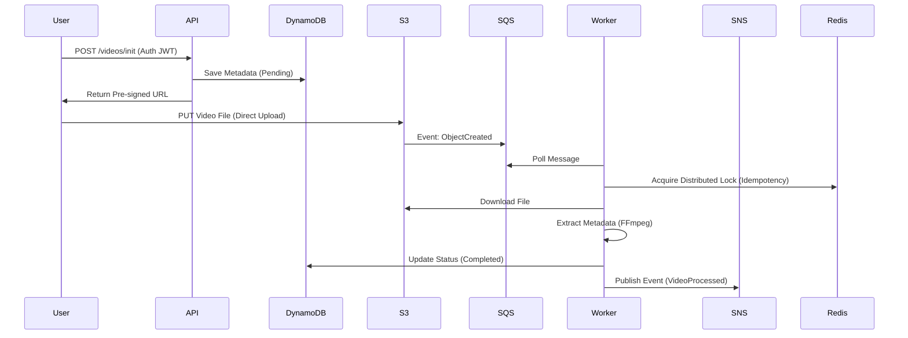

# StreamForge 🎥⚡

> **Plataforma de Processamento de Vídeo em Nuvem (Cloud Native Reference Architecture)**


O **StreamForge** é um microsserviço de alto desempenho projetado para demonstrar como construir aplicações distribuídas robustas, escaláveis e resilientes usando .NET moderno e serviços AWS (simulados localmente).

Ele resolve o problema de **latência no upload de grandes arquivos**, desacoplando a ingestão (API) do processamento (Worker) através de mensageria assíncrona.

---

## 🏗️ Arquitetura e Design

O projeto segue rigorosamente os princípios de **Clean Architecture** e **Domain-Driven Design (DDD)**.

### Diagrama de Fluxo


### Destaques Técnicos
*   **CQRS (MediatR):** Separação clara entre comandos de escrita e leitura.
*   **Event-Driven:** Comunicação assíncrona via SQS e SNS.
*   **Idempotência:** Implementação de **Distributed Locking** com Redis (RedLock) para garantir que mensagens duplicadas não causem inconsistência.
*   **Resiliência:**
    *   **Dead Letter Queues (DLQ)** para mensagens venenosas.
    *   **Auto-Provisioning:** O Worker recria a infraestrutura (Filas) se ela cair.
    *   **Health Checks:** Monitoramento ativo de dependências.
*   **Observabilidade:** Rastreamento distribuído com **OpenTelemetry** e logs estruturados no **Seq**.
*   **Segurança:** Autenticação JWT e validação rigorosa de input (**FluentValidation**).

---

## 🚀 Quick Start (Como rodar)

Você precisa apenas do **Docker** instalado. Não é necessário instalar o .NET SDK localmente.

### 1. Clonar e Subir
```bash
git clone https://github.com/faahiero/StreamForge.git
cd StreamForge

# Subir todo o ambiente (API, Worker, LocalStack, Redis, Seq)
docker-compose up -d --build
```

### 2. Testar (End-to-End)
Um script de teste automatizado está incluído para validar todo o fluxo (Upload -> Processamento -> Notificação).

```bash
# Rodar teste E2E via Docker
chmod +x test_docker_e2e.sh
./test_docker_e2e.sh
```

### 3. Acessar Dashboards
*   **API Swagger:** [http://localhost:5200/swagger](http://localhost:5200/swagger)
*   **Logs e Traces (Seq):** [http://localhost:5341](http://localhost:5341) (Login: `admin` / `admin`)

---

## 🛠️ Stack Tecnológico

| Categoria | Tecnologia | Uso |
| :--- | :--- | :--- |
| **Core** | .NET 8 / 10 | Plataforma base |
| **API** | ASP.NET Core | REST, Swagger, Middleware |
| **Worker** | IHostedService | Processamento background |
| **Data** | DynamoDB | Armazenamento de metadados NoSQL |
| **Storage** | AWS S3 | Armazenamento de arquivos |
| **Messaging** | AWS SQS / SNS | Filas e Pub/Sub |
| **Cache/Lock** | Redis | Controle de concorrência |
| **Media** | FFmpeg | Extração de metadados de vídeo |
| **Observability** | OpenTelemetry + Seq | Tracing e Logging centralizado |
| **DevOps** | Docker Compose | Orquestração local completa |

---

## 📚 Documentação Adicional

Para um mergulho profundo na arquitetura, decisões de design e explicação passo-a-passo:

*   [**Guia de Estudo Completo (STUDY_GUIDE.md)**](./STUDY_GUIDE.md) - **Leitura Obrigatória!** Explica o "Porquê" de cada linha de código.
*   [**Documentação de Arquitetura (ARCHITECTURE.md)**](./ARCHITECTURE.md) - Visão técnica e status do projeto.

---

## 🧪 Estratégia de Testes

O projeto possui uma pirâmide de testes completa:
1.  **Unitários (`xUnit`):** Testam Regras de Domínio e Handlers isolados.
2.  **Integração (`WebApplicationFactory`):** Testam a API e o pipeline HTTP em memória.
3.  **E2E (`Test Script`):** Testam o sistema rodando no Docker com infraestrutura real simulada (LocalStack).

Para rodar os testes unitários (requer .NET SDK):
```bash
dotnet test
```

---

## 📝 Licença
Este projeto é open-source e destinado a fins educacionais. Sinta-se livre para usar como template para seus microsserviços!
